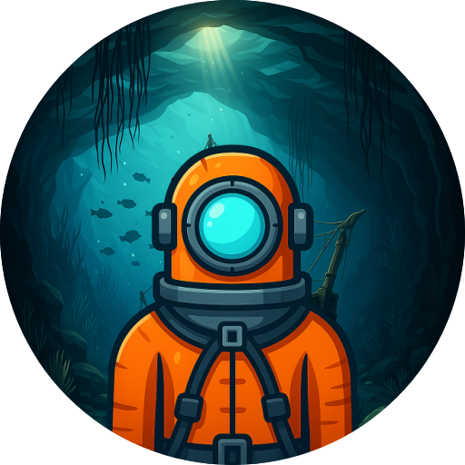

  
  
  # To The Depths
  
  
  
  **My first mobile game**

## About

A simple Android game with two minigames. This is my first game published on Google Play Store.

## Game Modes

**1. Dive In**
- Tilt your phone to move the scuba diver
- Avoid planks and piranhas
- Collect coins and beat your records

**2. Submarine**
- Hold finger to go up, release to go down
- Avoid stalactites and stalagmites
- Collect coins and toolboxes (healing)
- 3-hit health system

## What I've Learnt
- Basics of C# and Unity
- Simple 2D movement and gyroscope integration
- Managing screen resolution and orientation
- Basic sound and scene management
- Implementing rewarded ads with Unity Ads (legacy)
- Deploying to the Google Play Store

## Built With
Unity & C#

## Download

